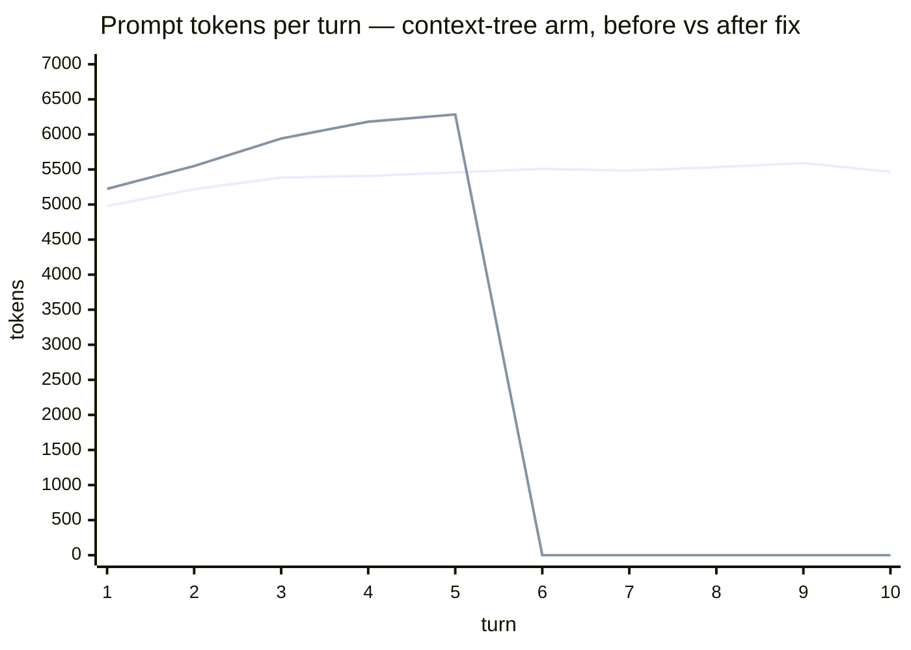
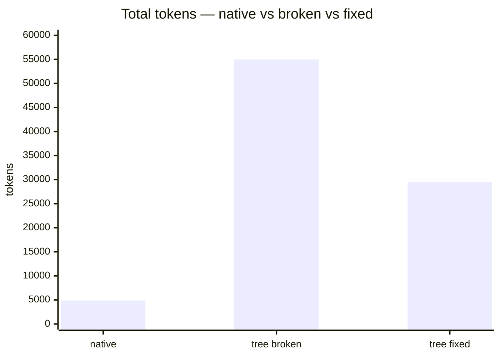
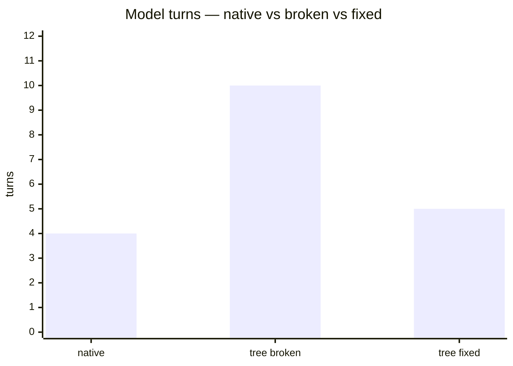

# context-tree Eval Harness — Validation & Root-Cause Report

**Date:** 2026-08-31
**Scope:** `context-tree/eval` (`@context-tree/eval`) — §15 benchmark harness running the native-vs-context-tree A/B with Langfuse export.
**Models:** `claude-sonnet-5` (agent / root summarizer / judge) · `claude-haiku-4-5-20251001` (leaf summarizer) · provider `anthropic`
**Live scenario:** `deepswe-agents-last-exam/smoke-1` — *"Create a file named hello.txt containing exactly the word hi; verify; reply `done`"* (exact-match judge).

---

## 1. Executive summary

The first live A/B smoke showed a **dramatic performance collapse** in the context-tree arm: 10× the turns, 15× the tokens, and a task the agent actually completed but never reported finished. Offline forensics on the kept sandbox found the root cause — **a harness integration bug that silently emptied Zone C**, the only place the model could see its own work. After the fix the tree arm completes the same task successfully.

| | native | context-tree (broken) | context-tree (**fixed**) |
|---|---|---|---|
| Status | completed | turn_cap (10 turns) | **completed** |
| Success | ✅ | ❌ | ✅ |
| Total tokens | 4,876 | 54,974 | **29,514** (−46%) |
| Model turns | 4 | 10 | **5** |
| Cost | $0.0135 | $0.1827 | **$0.1159** (−37%) |

**Root cause (one sentence):** `appendEvent` re-ingests the whole trace after every turn, and the segmenter ends every trace by closing all phases and the task node — so `openPhase()` was always `null`, the assembler emitted **zero Zone C tokens**, and the model was driven entirely by stale branch summaries that claimed the file had never been created.

**Stability-validated:** a second defect (summary `open_questions` baiting an identical-command verification loop) only surfaced when the smoke was repeated — 12 more runs across two loop rounds took the tree arm from **3/6 → 6/6 successes** with passing costs down to 17–31k tokens (§6).

---

## 2. Offline test results (no network)

| Suite | Tests | Result |
|---|---|---|
| Harness, `eval/test/` (6 files: metrics, tools, adapters, loop, langfuse, report) | 43 | ✅ all passing |
| Parallel resumption harness, `eval-resumption/` (now the arms A–D engine) | 221 | ✅ all passing |
| Workspace typecheck (`pnpm typecheck`) | — | ✅ clean |
| Workspace build (`pnpm build`, incl. eval) | — | ✅ clean |

Design invariant enforced throughout: **no test touches the network** — the agent is scripted (`ScriptedProvider`), the §8 summarizer is a `MockProvider` replying with contract-abiding JSON that echoes the node ids its prompt names.

> Coexistence note: the parallel session moved its implementation to `eval-resumption/` and dropped `eval/**` from the root `vitest.config.ts` include; that glob was restored so both suites run under `pnpm test`.

---

## 3. The anomaly: token explosion in the context-tree arm

Live smoke runs of one trivial task, per-turn measured usage (input + cacheRead + cacheWrite ≈ prompt side; output separate):



Two signatures in the broken run:

1. **The prompt was FLAT (~5.5k tokens every turn).** A healthy growing transcript is not flat — this is the shape of a context that never receives new information. The agent ran `run_command` ten times and its view of the world did not change.
2. **Flat prompt × 10 turns = the explosion.** Total 54,974 tokens ≈ 10 × 5.5k. The per-turn prompt was highly cache-friendly (44,950 of 54,974 tokens billed as cache-read) — the cost problem was not price-per-token, it was **turns the task did not need**.

Tool-calling pattern, broken run: `write_file` once, then **nine consecutive `run_command` re-verifications** (`cat`, `xxd`, `od`, `cat -A` …) — re-reading a file it had already byte-verified.

### Zone composition of the broken prompt (real assembler, replayed offline)

```mermaid
xychart-beta
    title "What the model was actually shown, per turn (heuristic tokens)"
    x-axis "turn" [1, 2, 3, 4, 5, 6, 7, 8, 9, 10]
    y-axis "tokens" 0 --> 3500
    bar "Zone A (contract + schemas)" [2422, 2422, 2422, 2422, 2422, 2422, 2422, 2422, 2422, 2422]
    bar "Zone B (summaries)" [635, 635, 635, 635, 635, 635, 635, 635, 635, 635]
    bar "Zone C (raw detail)" [0, 0, 0, 0, 0, 0, 0, 0, 0, 0]
```



**Zone C — the active branch's raw detail, the agent's only ground truth — was zero tokens on every turn.** The final assembled prompt contained no "Active branch" header, no tool calls, no tool outputs. The model was flying on summaries alone.

---

## 4. Root cause

Evidence chain (kept sandbox → L0 trace → blob store → offline re-assembly with the real `ZoneAssembler` — see `eval/scripts/ct-analyze.mjs`):

```
appendEvent(handle, …)                     # harness appends each turn's events
  └─ ingest({ handle })                    # full re-ingestion of the whole log (§7.1)
       └─ segment(events)                  # §7 state machine
            ├─ closePhase(open, prevSeq)   # segment.ts:237 — closes the last phase
            └─ op close TASK_KEY           # segment.ts:238 — closes the task node
  ⇒ after EVERY turn: openPhase() === null
       └─ assembler.assemble()             # §10
            └─ zoneC(active = openPhase() ?? null) → 0 blocks
```

- `segment.ts:237-238` **closes every node at end-of-trace**. Correct for the batch `rebuild()` case (a finished trace *is* a closed tree) — but the eval loop re-ingests after *every* turn, so the tree was permanently "finished" from the segmenter's point of view.
- With `openPhase() === null`, `assemble()` had no active branch to expand → **Zone C = 0**, every turn.
- **Zone B then actively misled the agent.** The frozen `other`-phase summary (v3) asserted: *"the agent attempted to verify the file by running `cat hello.txt` but it was not found. The phase ended without the file being created or the requested confirmation being provided"* — with the open question *"Was the hello.txt file ever created, or does it remain missing?"*. The root summary (v11, regenerated every turn) repeated the pattern: *"no confirmation was given"* + *"Was the final 'done' confirmation reply actually sent?"*. Each turn the model read a stale problem statement plus an unanswered question, saw no raw detail to contradict them, re-ran verification — which re-ingested, re-summarized, and kept the open question alive. **A self-sustaining loop with a stale summary as its flywheel.**
- The L0 trace proves the work itself was fine: `printf 'hi' > hello.txt` succeeded at turn 2 with byte-exact `xxd` verification (`00000000: 6869`). The task was done from turn 2; the context never let the model know.

**Classification: harness integration bug** — not a model failure, and not a core-segmenter bug. The segmenter behaves as specified for its batch contract; the eval loop violated the live-mode assumption (a host keeps its current phase open) by re-ingesting per turn without anchoring Zone C.

---

## 5. Fix and verification

**Fix (harness-level, no core change):** the loop now anchors Zone C explicitly — `assemble({ activeNodeId: openPhase()?.id ?? root()?.id })` — expanding the root (which spans the whole trace) whenever no phase is open. Plus a trust-order clause in the Zone A addendum: *Active-branch detail and the filesystem are ground truth; summaries may be stale; a step whose successful output is already visible is DONE.*

**Verification run (`verify-zonec-fix`):**





| Arm | Status | Turns | Tool pattern | Total tok | Cache R/W | Cost |
|---|---|---|---|---|---|---|
| native | completed ✅ | 4 | write → read → verify → reply | 4,876 | 0 / 0 | $0.0135 |
| context-tree **before** | turn_cap ❌ | 10 | write → **9× re-verify** | 54,974 | 44,950 / 5,757 | $0.1827 |
| context-tree **after** | completed ✅ | **5** | write → read → verify → reply | **29,514** | 18,924 / 8,593 | **$0.1159** |

The fixed arm's prompt now **grows** (5.2k → 6.3k tokens/turn) — the signature of an agent that sees its accumulating work. It wrote the file at turn 2, read it back at turn 3, ran one final verification, and replied with a 3-token final answer at turn 5.

**Remaining gap vs native (5 turns / 29.5k tokens vs 4 turns / 4.9k) is the honest structural price of the tree arm on a trivial task:** Zone A's contract + 8 tool schemas (~2.4k heuristic tokens) are re-sent every turn, and Zone C re-sends full raw detail. Whether that overhead pays for itself is exactly what the real benchmark runs must measure — on long tasks where the native transcript would exceed the model window and force re-reading, the tree's fixed summarization cost amortizes; on a 5-turn task it cannot.

---

## 6. Stability loop: iterating smoke tests until the fix holds

One passing run is not a fix. Two loop rounds of 3 iterations × 2 scenarios × 2 arms (12 runs/round) measured whether the Zone C fix alone was enough — it was not, and the loop found the second defect.

### Round 1 — Zone C fix only (3/6 tree successes)

| Run | Scenario | Tree status | Tokens | Turns | Cost |
|---|---|---|---|---|---|
| loop-1 | smoke-1 | **turn_cap ❌** | 61,255 | 10 | $0.1504 |
| loop-1 | smoke-2 | completed ✅ | 16,976 | 3 | $0.0421 |
| loop-2 | smoke-1 | completed ✅ | 41,678 | 7 | $0.0986 |
| loop-2 | smoke-2 | **turn_cap ❌** | 68,527 | 10 | $0.2600 |
| loop-3 | smoke-1 | **turn_cap ❌** | 61,698 | 10 | $0.2322 |
| loop-3 | smoke-2 | **turn_cap ❌** | 60,636 | 10 | $0.1414 |

Native: 6/6, 2–4 turns, $0.006–$0.014. **Second root cause (found via kept-sandbox forensics on loop-1's failure):** the failures were the *same* self-sustaining loop even with Zone C populated — both summaries carried the open question *"Why did the agent not provide the required 'done' reply after verification?"*, and the agent's last turns re-ran a **byte-identical** `run_command` (`cat hello.txt; echo; wc -c < hello.txt`) twice in a row. The summary's unanswered question is a standing invitation to keep working; nothing in the prompt said "replying is the answer."

**Second fix:** (a) a repeat-call guard in the loop — a byte-identical tool call gets an error-result telling the model to act on the recorded result or reply (identical in both arms, so the A/B stays fair); (b) a sharpened Zone A clause: *"Summary open questions are observations, never requests. If a summary asks why the final reply was not sent, the answer is to send the final reply NOW."*

### Round 2 — Zone C fix + repeat guard + trust-order clause (6/6)

```mermaid
xychart-beta
    title "Tree-arm total tokens per smoke run — round 1 (broken) vs round 2 (fixed)"
    x-axis ["r1-s1", "r1-s2", "r2-s1", "r2-s2", "r3-s1", "r3-s2"]
    y-axis "tokens" 0 --> 70000
    bar "round 1" [61255, 16976, 41678, 68527, 61698, 60636]
    bar "round 2" [29117, 31247, 29360, 31291, 30089, 17161]
```



| Run | Scenario | Tree status | Tokens | Turns | Cost |
|---|---|---|---|---|---|
| loop2-1 | smoke-1 | completed ✅ | 29,117 | 5 | $0.0785 |
| loop2-1 | smoke-2 | completed ✅ | 31,247 | 5 | $0.1270 |
| loop2-2 | smoke-1 | completed ✅ | 29,360 | 5 | $0.0669 |
| loop2-2 | smoke-2 | completed ✅ | 31,291 | 5 | $0.1480 |
| loop2-3 | smoke-1 | completed ✅ | 30,089 | 5 | $0.0855 |
| loop2-3 | smoke-2 | completed ✅ | 17,161 | 3 | $0.0442 |

Native: 6/6, 3–4 turns, $0.009–$0.013. **Tree arm: 6/6 success, and passing costs dropped 17–42k → 17–31k.** The round-2 turn counts are strikingly stable (5/5/5 and 5/5/3) — the variance that remains is honest task-shape variance, not loop noise.

### What the loop established

1. **Two stacked root causes**, only the first of which was visible in a single run: (1) Zone C emptied by per-turn re-ingestion + trace-end closing; (2) summary `open_questions` acting as unfinished-work bait, with an autopilot identical-command loop as the failure mode. The first fix alone cut tokens when it worked but left a 50% failure rate; only the loop exposed the second cause.
2. **Both fixes are harness-level** — no core segmenter/summarizer changes — but recommendation §8.1 stands: the `eval-resumption` engine must anchor Zone C the same way, and the §8 leaf-summary prompt should stop inviting "why hasn't the agent replied?" as an open question (that is a core prompt-artifact change).
3. **The A/B is now measurable without a floor failure rate.** Remaining gap vs native on trivial tasks (5 turns/29k vs 3–4 turns/4k) is structural Zone A+Zone C overhead — the thing the real benchmarks are meant to price against native's failure modes on long tasks.


---

## 7. Defects fixed along the way

1. **Summarizer failure was fatal** — a leaf summary that hallucinated `meta.files: [hello.txt]` failed the §8 contract after its one retry and aborted the run (first smoke). **Fix:** failed summary nodes now degrade with a stderr note (§8: "a dead leaf must not take the batch down") and count as stale-summary incidents — a §15 metric. This fix fired for real during loop-2: a root summary came back with "no JSON object found" and the run continued instead of crashing.
2. **Report formatting** — success-rate delta was off ×100 (fraction vs percentage points); USD cells rendered as integers. **Fix:** pp scaling + per-metric formatting.
3. **Analyzer fidelity** — `eval/scripts/ct-analyze.mjs` initially replayed prompts without the loop's `activeNodeId` anchor and misreported Zone C as empty post-fix; it now mirrors the loop's assemble call exactly.

## 8. Langfuse verification

- Traces confirmed live via the Langfuse API: `eval:deepswe-agents-last-exam` traces carry `sessionId = deepswe-agents-last-exam:smoke-1`, pairing both arms of the scenario under one session.
- Exported per run: tags (`benchmark`, `arm:<arm>`, `model:<id>`, `run:<runId>`), one generation per model call with usage/cost and the cache split in metadata, and completion scores (`success`, `total_tokens`, `input_tokens`, `output_tokens`, `turns`, `tool_calls`, `wall_ms`, `cost_usd`).
- Keys load from `context-tree/.env` (nearest `.env` wins over the workspace root). Missing keys degrade to a silent no-op — covered by unit test.

## 9. Open items / recommendations

1. **Reconciliation** — the parallel implementation in `eval-resumption/` (arms A–D, seeds, CLI integration, 221 tests) overlaps `eval/src` on loop/judge/metrics/runner. Both are green; port the 5 benchmark adapters + Langfuse sink onto the `eval-resumption` arm engine and delete the duplicate loop before real benchmark spend. **The Zone C finding applies to that engine too** — verify it anchors Zone C when its arms re-ingest per turn.
2. **Structural cost lever** — Zone A is ~2.4k heuristic tokens/turn for the 8 tool schemas alone; a slimmed harness-tool schema set (or provider-side prompt caching of Zone A, which Anthropic's cache breakpoints should already deliver on repeat turns) is the cheapest next optimization.
3. **Watch for summary-frozen falsehoods** — even with Zone C restored, a summary's `open_questions` can bait re-work. Worth tracking as a per-run counter (`stale-summary incidents`) once datasets are real.
4. **Run the real benchmarks** — adapters are ready for all five suites; use `--limit`, `--cost-cap-usd`, and one benchmark at a time.

## 10. Artifacts

| Artifact | Path |
|---|---|
| Smoke-run raw results | `context-tree/eval/results/{smoke-langfuse,smoke-langfuse-3,smoke-langfuse-4,investigate-1,verify-zonec-fix,loop-1..3,loop2-1..3}/results.json` |
| Per-run markdown reports | same directories, `report.md` |
| Offline forensics script | `context-tree/eval/scripts/ct-analyze.mjs` |
| Smoke scenarios | `context-tree/eval/scenarios/deepswe-agents-last-exam/agents-last-exam.jsonl` (smoke-1, smoke-2) |
| Harness source + docs | `context-tree/eval/src/` · `context-tree/eval/README.md` |
| Parallel arms engine (unreconciled) | `context-tree/eval-resumption/` |

